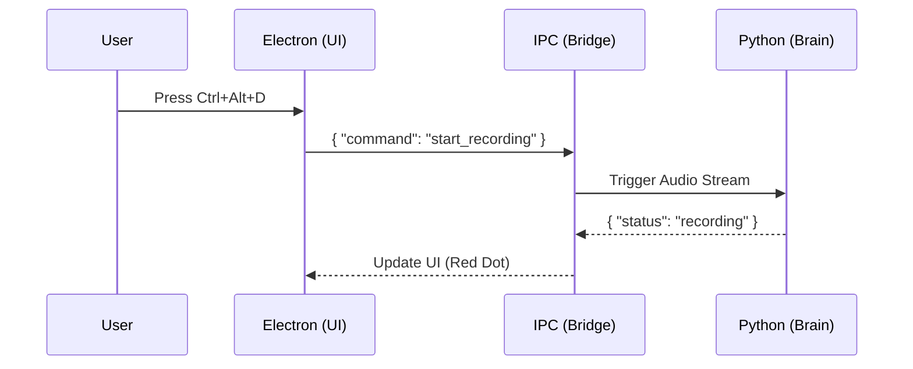

# 🎓 The dIKtate Masterclass: Building Local AI Tools

> **Welcome, Developer.**
> This isn't just a README. This is a guide to the architecture of a modern, local-first AI application.
> We believe the best way to trust software is to understand how it's built.

---

## 1. The Stack: "Department of One" Architecture

We chose this stack for one reason: **Speed of Development.** 

-   **Frontend:** **Electron + React + Tailwind**. 
    -   *Why?* It allows us to build beautiful, transparent overlays (the "Floating Pill") using standard web tech.
-   **Backend:** **Python**.
    -   *Why?* It is the native language of AI. `faster-whisper`, `ollama`, and `pytorch` all live here.
-   **The Glue:** **ZeroMQ / StdIO IPC**.
    -   *Why?* We need these two worlds to talk instantly (<10ms latency).

---

## 2. The Bridge: How Electron talks to Python

Most Electron apps fail because they try to do too much in Node.js. We don't.
We treat Electron as a **Dumb View** and Python as the **Smart Brain**.

**Lesson:** Keep your UI thread free. Never block the renderer.

---

## 3. The Brain: Local Intelligence

We use a "pipeline" approach to processing voice:

1.  **The Ear (`recorder.py`):** Captures raw PCM audio via PyAudio.
2.  **The Scribe (`transcriber.py`):** Passes audio to `faster-whisper` (running on GPU if available). It outputs raw text.
3.  **The Editor (`processor.py`):** The raw text is often messy ("um, uh, new line"). We send it to **Ollama (Llama 3)** with a system prompt: *"You are an editor. Fix this text."*
4.  **The Typist (`injector.py`):** The clean text is pasted into the user's active window.

---

## 4. Building the "Power Version"

Want to extend dIKtate? Here is where to look:

-   **Adding New AI Models:** Check `python/processor.py`. You can plug in Gemini, Claude, or any local GGUF model here.
-   **Changing the UI:** Check `src/components/StatusWindow.tsx`. This is the React component that floats on screen.
-   **Custom Hotkeys:** Check `src/main.ts`. We use Electron's `globalShortcut` API.

---

## 5. Why Open Source?

We give this code away because we believe **Local AI is the future**.
By building it yourself, you learn:
-   How to manage Python environments in production.
-   How to handle real-time audio streams.
-   How to secure API keys locally.

**Start Hacking:**
1.  Run `pnpm install`
2.  Run `pip install -r requirements.txt`
3.  Run `pnpm dev`

*Class is in session.*
