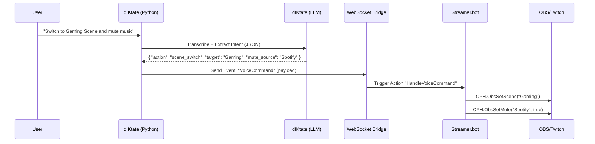

# Streamer Satellite Concept: "The Automated Co-Host"

> **Project:** dIKtate Satellite (Streamer Edition)
> **Goal:** Repurpose the local voice/LLM stack to control streams and interact with chat via voice.
> **Philosophy:** "Listen → Think → Act" (Voice-to-Action) instead of Voice-to-Text.

---

## 1. The Architecture

The system splits responsibilities between **dIKtate** (The Brain) and **Streamer.bot** (The Brawn).



### Why this stack?
- **dIKtate (Local LLM):** 4B models are *perfect* for natural language understanding ("NLU"). They can easily parse messy speech into clean JSON.
- **WebSocket:** Standard, fast, low-latency (<50ms).
- **Streamer.bot:** Has robust C# integration for OBS, Twitch, YouTube, Kick. We don't need to rebuild those APIs. We just trigger them.

---

## 2. Core Features

### A. The Commander (Voice Control)
Control your stream without alt-tabbing or buying an Elgato Stream Deck.
- **User:** "Clip that last 30 seconds and post it to Discord."
- **LLM Output:** `{"action": "clip_and_post", "duration": 30, "platform": "discord"}`
- **Streamer.bot:** Runs `CPH.CreateClip()`, gets URL, posts to Discord webhook.

### B. The Co-Host (Persona TTS)
A local AI personality that reads chat and donations.
- **Trigger:** Twitch Chat Event (e.g., "!ask Can a robot love?")
- **dIKtate:** Receives text -> LLM (Persona Prompt: "Sarcastic Robot") -> Generates response.
- **TTS:** Generates audio (Kokoro/StyleTTS2).
- **Output:** Plays audio to Virtual Cable -> OBS Audio Source.
- **Why Local?** No character limit, no cost, faster response than cloud TTS.

### C. The Moderator (Toxicity Filter)
- **Trigger:** Incoming Chat Message.
- **dIKtate:** LLM analyzes sentiment/toxicity.
- **Action:** If toxic -> Send "Timeout" command to Streamer.bot.
- **Advantage:** Smarter than keyword lists. Context-aware.

### D. The Giveaway Manager (Fair & Long-term)
**Problem:** Streamers hate managing monthly/bi-monthly giveaways manually (spreadsheets, "fairness" anxiety).
- **Voice Command:** "Start a monthly giveaway for the Keyboard."
- **Action:**
  - AI tracks eligibility over time (via Streamer.bot history).
  - Handles entries seamlessly across streams.
  - Picking a winner: "Computer, pick a fair winner for the monthly giveaway." -> AI weights active viewers, filters bots, announces winner.
- **Advantage:** "Set and Forget" fairness managed by local logic.

---

## 3. Implementation Plan

### Phase 1: The Bridge
- Build a dIKtate "Mode" called **Command Mode**.
- Output is not text injection, but **WebSocket Emission**.
- Connect to `ws://127.0.0.1:8080` (Streamer.bot default).

### Phase 2: The Intent Model
- Create a specific system prompt for **JSON Extraction**.
- Example Prompt:
  ```text
  You are a stream controller. Map the user's voice to one of these actions:
  - change_scene (scene_name)
  - play_sound (sound_name)
  - toggle_source (source_name, visible)
  Output JSON only.
  ```

### Phase 3: The Streamer.bot Library
- Provide a pre-built `.sb` import file for users.
- Contains C# actions to handle the JSON payloads from dIKtate.

---

## 4. Market Positioning (The Niche)

Existing "AI Streamer" tools exist (Neuro-sama clones, TTS bots), but they heavily rely on cloud APIs (costly) or complex setups.

**dIKtate's Differentiator: "Studio Automation First, Personality Second"**

1.  **The Utility Hook:** Most streamers want *control* ("Switch scene", "Clip that"), not just a chatting robot. We solve the workflow problem first.
2.  **The Privacy/Cost Hook:** "Why pay $15/mo for a cloud bot when your 4090 can run a smarter one for free?"
3.  **The Integration:** Direct WebSocket to Streamer.bot puts us in the pro-grade ecosystem immediately, avoiding "toy" status.

---

## 5. Competitive Advantage

| Feature | Cloud Tools (Touch Portal, etc.) | dIKtate Satellite |
|---------|---------------------------------|-------------------|
| **Cost** | Subscription / Hardware cost | **Free / OSS** |
| **Privacy** | Cloud-based | **100% Local** |
| **Control** | Button-based (rigid) | **Natural Language (fluid)** |
| **Latency** | Internet-dependent | **Local Network (Instant)** |

---

## 5. Technical Requirements (User Side)
- **GPU:** NVIDIA RTX (already common for streamers).
- **Software:** Streamer.bot (Free), OBS Studio (Free).
- **RAM:** 16GB+ (to run Game + OBS + LLM). *NOTE: This is a constraint.*
