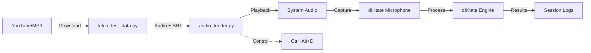

# SPEC_002: Audio Feeder (The "Couch Potato" Test)

> **Status:** DRAFT
> **Owner:** Gemini (Antigravity)
> **Date:** 2026-01-21

## 1. Objective
To implement a robust, automated stress-testing framework that validates the dIKtate pipeline using **external, high-valud audio sources** (Movies, TV Shows, Podcasts) rather than synthetic speech or repetitive manual reading.

## 2. The Concept
The "Couch Potato Test" simulates a user dictating for hours by feeding pre-recorded human speech into the system. It leverages **Subtitle Files (.srt)** to act as the "Ground Truth" and to provide perfect audio segmentation.

### Architecture

## 3. Components

### A. Data Fetcher (`python/tools/fetch_test_data.py`)
-   **Function:** Downloads audio and subtitles from a URL (YouTube).
-   **Engine:** `yt-dlp`.
-   **Output:**
    -   `tests/fixtures/downloads/<id>.wav` (Audio)
    -   `tests/fixtures/downloads/<id>.srt` (Subtitles)

### B. Audio Feeder (`python/tools/audio_feeder.py`)
-   **Function:** Plays audio segments synchronized with dIKtate's recording state.
-   **Logic:**
    1.  Parse `.srt` file.
    2.  For each subtitle entry:
        -   **Trigger Start:** Send `Ctrl+Alt+D` (Global Hotkey).
        -   **Play:** Audio segment (`start_time` to `end_time`).
        -   **Trigger Stop:** Send `Ctrl+Alt+D`.
        -   **Log:** Expected text (from subtitle).
        -   **Wait:** Configurable pause (e.g., 5s) for processing.
    3.  **Loop:** Optional infinite loop for stress testing.

## 4. Requirements
-   **Python Packages:** `yt-dlp`, `pysrt`, `pydub`, `simpleaudio`, `pynput`.
-   **System:** `ffmpeg` (in PATH).
-   **Hardware:** Microphone must be able to capture speaker output (or use VB-Cable).

## 5. Workflow
1.  **Fetch:** `python python/tools/fetch_test_data.py "https://youtube.com/..."`
2.  **Run:** `python python/tools/audio_feeder.py --last`
3.  **Analyze:** Compare `session_logs` against `feeder_logs` (Future Work: Auto-grading).
