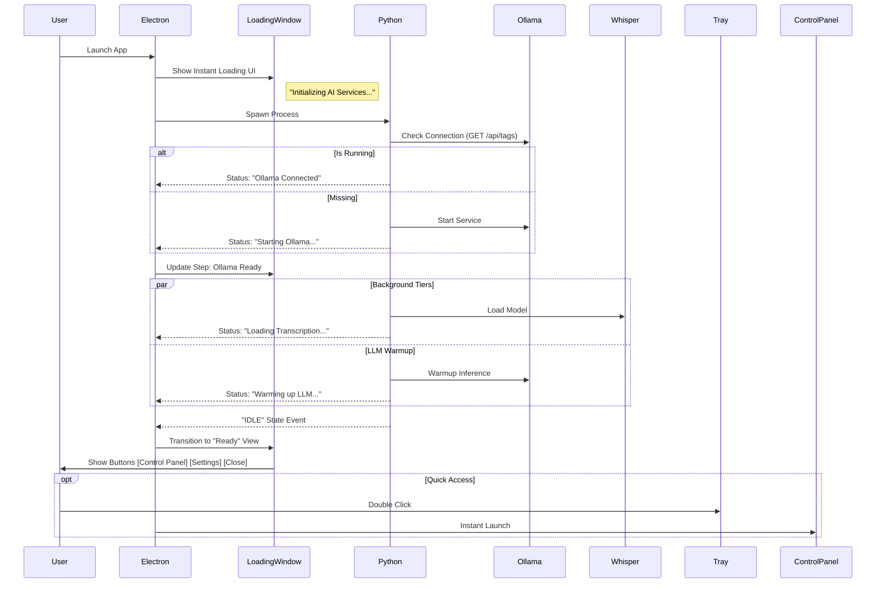

# SPEC_035: Startup Sequence Optimization & Loading Window Orchestration

**Status:** APPROVED FOR IMPLEMENTATION
**Created:** 2026-01-29
**Updated:** 2026-01-30
**Target:** v0.2.1
**Focus:** Performance, User Trust, Architecture
**Related Specs:** [SPEC_032](./SPEC_032_SETTINGS_PAGE_REFACTOR.md)

---

## 1. Problem Statement

dIKtate's startup involves heavy resource initialization: checking Ollama, loading Whisper (4GB+), and warming up the LLM. 
The previous approach (blocking warmup) meant the user stared at nothing for ~15 seconds while the backend initialized. The "Instant Tray" pivot (v0.2.0 draft) solved availability but created a "stalled" experience where the tray appeared but dictation failed silently.

Furthermore, current initialization pre-loads several `BrowserWindow` instances (Control Panel, Settings) which consumes memory and CPU during the critical startup window, even if the user doesn't need them immediately.

## 2. Technical Solution: "Loading Window" Orchestration

We will pivot to a **Managed Loading** strategy. Instead of jumping straight to the tray or blocking entirely, the app will show a lightweight, informative loading window that tracks the parallel initialization of backend services.

### 2.1 Benefits
1.  **Transparency:** Users see *exactly* what is happening (e.g., "Starting AI Engine...").
2.  **Diagnostics:** If a step fails (e.g., Ollama not found), the user sees the specific error immediately.
3.  **Perceived Speed:** Immediate UI feedback (<1s) makes the app feel responsive, even while loading heavy models.
4.  **Resource Efficiency:** Heavy UI windows (Control Panel, Settings) are loaded *lazily* (on-demand only).

### 2.2 Sequence Diagram

---

## 3. Implementation Details

### 3.1 Lazy UI Loading (The "Debloat" Rule)
To ensure the fastest possible path to "Model Ready", the application must defer loading non-essential Windows.

**Rules:**
1.  **Do Not Pre-create:** The `settingsWindow` and `debugWindow` (Control Panel) MUST NOT be instantiated during the `initialize()` function.
2.  **Explicit Request:** These windows are only created when the user clicks a button (in the Loading Window or Tray) or uses a hotkey.
3.  **Bootstrap Only:** Only load variables/constants required for the startup process (path configs, store defaults).

### 3.2 Loading Window (`src/loading.html`)
A new, standalone HTML file for the startup phase.

*   **UI:** Minimalist, centered, non-resizable, always-on-top.
*   **Dynamic Status:** Listen for `startup-progress` events from the main process.
*   **Ready State:** Once backend is `IDLE`, show a success checkmark and buttons:
    *   **Open Control Panel**: Spawns Control Panel and closes Loading Window.
    *   **Settings**: Spawns Settings and closes Loading Window.
    *   **Close**: Closes window (app remains in tray).

### 3.3 Python Backend (`ipc_server.py`)
Modify the startup logic to be more granular.

**Changes:**
1.  **Ollama First:** The `_ensure_ollama_ready` check must happen *before* attempting to spawn the process to avoid double-process conflicts.
    *   Logic: Check port 11434 first. If active, skip spawn. If inactive, spawn `ollama serve`.
2.  **Granular IPC:** Emit specific sub-states for UI feedback:
    *   `STARTUP_MSG: "Checking for Ollama..."`
    *   `STARTUP_MSG: "Loading transcription model..."`
    *   `STARTUP_MSG: "Warming up LLM..."`
3.  **Safety Guards:** Ensure `start_recording` continues to block (with a "Still warming up" message) until `warmup_complete` is true.

### 3.4 Electron Main (`main.ts`)
*   Change entry point: `app.on('ready', () => createLoadingWindow())`.
*   Initialize Tray in background (hidden initially or inactive).
*   **Tray UX:** Add a `double-click` event listener to the `Tray` icon that opens/focuses the Control Panel window instantly.
*   Proxy Python status messages to the Loading Window via `webContents.send`.

---

## 4. Execution Plan

1.  **Loading UI:** Create `src/loading.html` and `src/loading.css` with a clean, branded design.
2.  **Backend Instrumentation:** Add granular progress logging and the "Ollama Check" logic in `ipc_server.py`.
3.  **Main Orchestration:** Implement `createLoadingWindow` and update `initialize()` to use deferred window loading.
4.  **Verification:**
    *   Launch app -> Observe immediate window.
    *   Verify statuses reflect actual work (Ollama -> Whisper -> LLM).
    *   Verify Control Panel does not exist in memory until button/tray click.
    *   Verify Tray Double-Click opens Control Panel.

---

## 5. Implementation Journal & Pitfalls

### 6. Post-Warmup Stall Identification (2026-01-30)
Validation revealed a secondary 12-15 second stall between the "Warmup Release" signal and UI responsiveness. This is attributed to Main Process congestion (event loop starvation) caused by:
1.  **I/O Spike**: A burst of buffered logs from the Python process overwhelming the Electron `readline` and `logger` handlers.
2.  **Synchronous Tasks**: The `initialize()` function awaiting `syncPythonConfig` while the event loop is flooded with log events.

**Mitigation Plan:**
- Throttle/Discard non-essential logs during critical transitions.
- Yield the event loop more aggressively during `initialize()`.

### 7. Final Findings: Task Queue Flooding (2026-01-30)
Validation on high-end hardware (Ryzen 9 / 4060 Ti) confirmed that CPU/GPU/RAM are not the bottlenecks. The secondary 12-15s stall is a **Task Queue Flooding** issue within the Electron Main Process.

**The Root Cause:**
Even when logs are "silenced" in the Logger, the Node.js `readline` interface and the Python `stderr` stream still fire events for *every single line* emitted by the backend. library initialization (CUDA, Torch, etc.) can emit 10,000+ lines in <1 second. This schedules 10,000+ micro-tasks on the Electron Event Loop. While each task is tiny, the cumulative backlog chokes the UI message pump and delays high-level timers (like the "Ready" transition) by ~12 seconds.

**Recommended Architectural Fixes:**
1.  **Silent Backend (Preferred)**: Modify the Python backend's logging configuration in `ipc_server.py` to `ERROR` level during the warmup phase. This prevents the "Noise" from ever entering the IPC pipe.
2.  **Worker Thread Orchestration**: Offload the `PythonManager` and its stream listeners to a dedicated Electron Worker Thread. This physically decouples the I/O noise from the Main Process's window message loop.
3.  **IPC Decoupling**: Move from line-buffered I/O to a more structured message protocol that doesn't rely on the high-frequency `stderr` stream for status.
